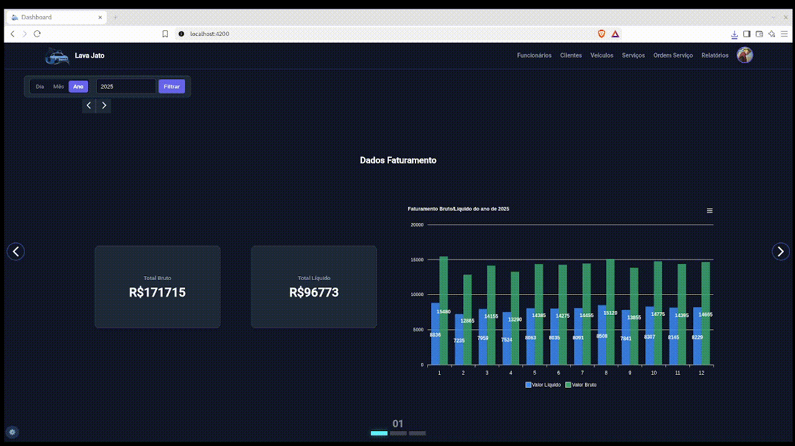
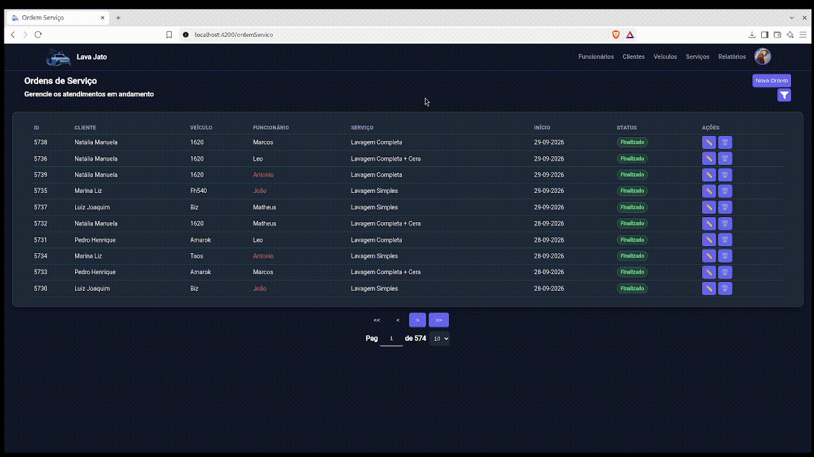
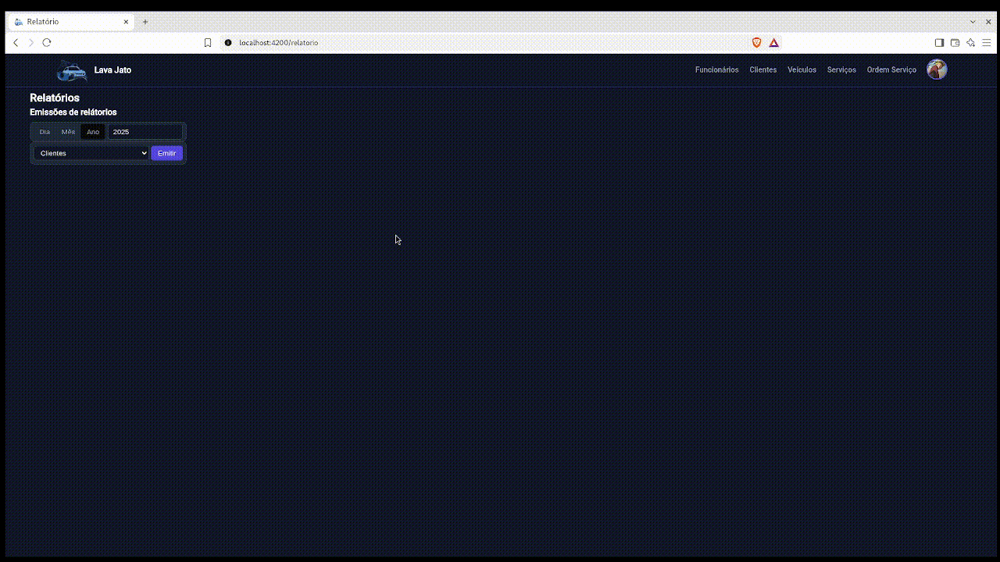
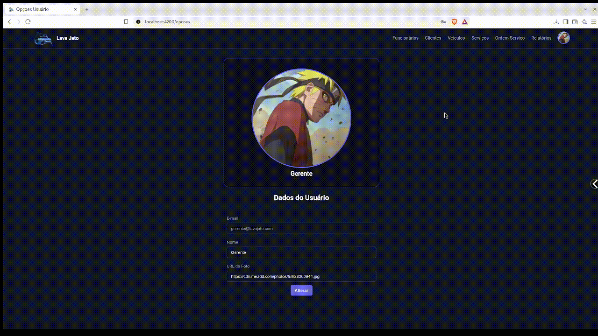

# Lava Jato Frontend


## 📌 Sobre o Projeto

O **Lava Jato**  é um sistema web voltado para gestão operacional e financeira de lava-rápidos.

O sistema inclui:
- gestão de clientes e veículos;
- controle de serviços e ordens de serviço;
- autenticação e permissões por perfil;
- dashboard com métricas e gráficos;
- relatórios financeiros e operacionais;
- filtros avançados para consultas e acompanhamento;
- integração com API REST.


## 🎥 Demonstração do Sistema

<div align="center">

### 📊 Dashboard Analytics & 📋 Ordens de Serviço

 

_Dashboard com gráficos/métricas e Gestão operacional de Ordens de Serviço._

<br />

### 📑 Emissão de Relatórios & 👤 Perfil do Usuário

 

_Filtros parametrizados por período e Gestão de dados/avatar do usuário._

</div>

## 🚀 Funcionalidades

**Integração com API:** consumo de endpoints REST para envio e recebimento de dados, feedback de validações e geração de relátorios.

**Controle de acesso:** permissões diferentes para diferentes tipos de usuários (ADM, Gerente e Funcionário).

**Gerenciamento de entidades:** CRUD completo de entidades, validações e paginação.

**Filtros dinâmicos:** busca por período (dia, mês, ano), clientes, funcionários, entre outros.

**Telas responsivas:** responsividade das telas do sistema através do @media.

**Componentes externos:** uso do ng-select para selects com pesquisa integrada e ApexCharts para a geração de gráficos modernos na tela de dashboard.

---

## 🛠️ Tecnologias Utilizadas

- **Framework**: [Angular](https://angular.io/) (v22)
- **Linguagem**: TypeScript
- **Estrutura**: HTML5
- **Estilização**: CSS3
- **Gerenciamento de Estado / Asincronismo**: RxJS
- **Gráficos e Métricas**: ApexCharts (`ng-apexcharts`)


---

## 📱 Telas e Funcionalidades

- **Dashboard Executivo**:
  - Visão geral de faturamento bruto e líquido.
  - Indicadores de clientes atendidos, serviços finalizados e ordens em andamento.
  - Métricas da equipe e destaque de colaboradores.
- **Gestão Operacional**:
  - Cadastro e filtragem de veículos por múltiplos critérios.
  - Vínculo de clientes com múltiplos veículos registrados.
  - Acompanhamento de Ordens de Serviço (em andamento / concluídas).
- **Controle de Acesso e Permissões**:
  - Visualização condicional de dados sensíveis com base no perfil logado (`GERENTE`, `ADM`, `FUNCIONARIO`).

---

```bash
lava-jato-frontend/
├── public/                      # Imagens, ícones e arquivos estáticos
├── src/
│   ├── app/
│   │   ├── _pipes/              # Pipes personalizados
│   │   ├── interceptor/         # Interceptador de requisições
│   │   ├── models/              # Interfaces e tipos
│   │   ├── pages/               # Páginas da aplicação
│   │   ├── services/            # Serviços para comunicação com a API
│   │   ├── util/                # Classes utéis e reutilizáveis
│   ├── assets/
│   │   ├── demo/                # Arquivos de demonstração do projeto
│   ├── environments/            # Configurações de ambiente (local, dev, remoto)
│   ├── index.html
│   ├── main.ts
│   ├── material-theme.scss      
│   └── styles.css
├── .gitignore
├── angular.json
├── package.json
├── README.md
└── tsconfig.json
```

## ⚙️ Projeto Backend

O sistema conta também com um backend desenvolvido em Spring Boot, responsável por fornecer os endpoints REST consumidos pelo frontend.
- repositório: https://github.com/ViniciusSB/lava-jato-backend

## 🔐 Requisitos
Antes de executar o projeto, certifique-se de ter instalado:

- Node.js
- npm ou yarn
- Angular CLI

## ▶️ Como Executar Localmente

Clone o repositório:

```
git clone https://github.com/ViniciusSB/lava-jato-frontend
```

Acesse a pasta do projeto:

```
cd lava-jato-frontend
```

Instale as dependências:

```
npm install
```

Inicie a aplicação:

```
ng serve
```

Acesse no navegador:

```
http://localhost:4200
```

## 👨‍💻 Autor
Vinícius Santos Bessa

LinkedIn: https://www.linkedin.com/in/viniciussabessa/